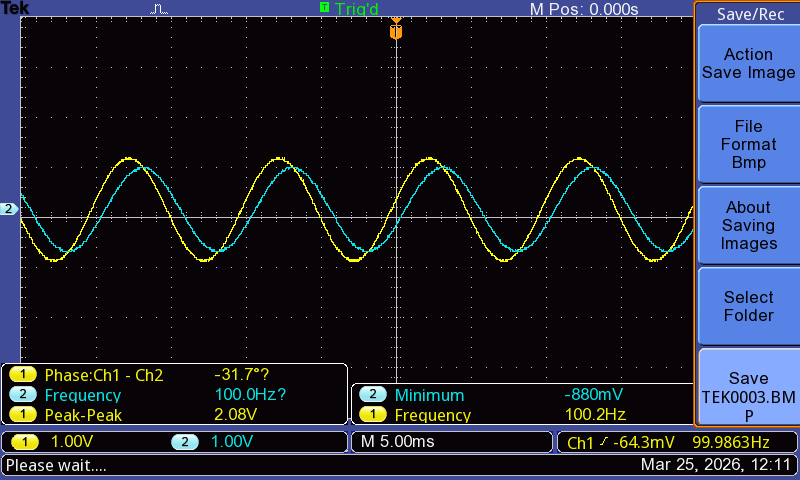

# RC Filter Signal Analysis with Arduino

This project studies the behavior of a first-order RC low-pass filter using both Arduino-based signal generation and real-world experimental validation.

It combines:

- Analog electronics (RC filter)
- Embedded systems (Arduino PWM + ADC)
- Numerical modeling
- Signal analysis
- Experimental oscilloscope measurements

## Project Overview

The goal of this project is to understand how a first-order RC low-pass filter responds to time-varying inputs, and to compare:

- theoretical predictions
- simulated behavior in LTSpice
- measured hardware results

The project includes two complementary parts:

1. **Arduino-based signal generation and ADC logging**
2. **Oscilloscope-based measurement of sinusoidal test signals**

## Circuit

The core circuit is a standard RC low-pass filter.

- **R = 1 kΩ**
- **C = 100 µF**

Time constant:

\[
\tau = RC = 0.1\ \text{s}
\]

For the Arduino experiment, the input signal is approximated using PWM and follows:

\[
V(t) = 2.5\left(1 + 0.5\sin(\omega_1 t) + 0.5\sin(\omega_2 t)\right)
\]

Two potentiometers control the angular frequencies \(\omega_1\) and \(\omega_2\).

The Arduino outputs a PWM signal whose duty cycle approximates this waveform.

## Arduino Measurements

The Arduino measures the voltage across the capacitor using the ADC and logs the following data:

- input signal
- measured capacitor voltage
- theoretical RC response
- potentiometer values
- time

The data is exported as CSV files for later analysis in Python.

## Theoretical Model

The capacitor voltage is modeled using the first-order RC update equation:

\[
V_c(t+\Delta t) = V_c(t) + (V_{in} - V_c(t))\left(1 - e^{-\Delta t/\tau}\right)
\]

This allows direct comparison between the theoretical response and the measured circuit output.

## Experimental Validation with Oscilloscope

To validate the low-pass filter behavior with sinusoidal inputs, additional experiments were performed using a function generator and oscilloscope.

The output voltage across the capacitor was measured under different frequency and RC conditions.

### Selected Experimental Cases

| Test | R | C | RC | Frequency | \|H(jω)\| | Observation |
|------|---|---|----|-----------|-----------|-------------|
| 1 | 1 kΩ | 100 nF | 0.1 ms | 100 Hz | 0.988 | Minimal attenuation |
| 2 | 10 kΩ | 100 nF | 1 ms | 100 Hz | 0.847 | Noticeable attenuation with larger RC |
| 3 | 10 kΩ | 100 nF | 1 ms | 200 Hz | 0.623 | Moderate attenuation |
| 4 | 10 kΩ | 100 nF | 1 ms | 1 kHz | 0.157 | Strong attenuation |

These measurements clearly show the frequency-dependent attenuation of a first-order RC low-pass filter.

## Oscilloscope Measurements

### 01 — Low frequency, small RC
At 100 Hz with RC = 0.1 ms, the capacitor voltage closely follows the input, indicating minimal attenuation.

**Notes:**
- Frequency ≈ 100 Hz
- Minimal attenuation
- Output closely follows input

### 02 — Low frequency, larger RC
At 100 Hz with RC = 1 ms, the output amplitude is reduced compared with the previous case, showing the effect of a larger time constant.

**Notes:**
- Frequency ≈ 100 Hz
- Larger RC produces stronger attenuation
- Clear reduction in output amplitude

### 03 — Mid frequency
At 200 Hz with RC = 1 ms, the output shows moderate attenuation, representing the transition region of the low-pass filter.

**Notes:**
- Frequency ≈ 200 Hz
- Moderate attenuation is visible
- Output waveform lags behind the input
- Transition region of the low-pass filter

### 04 — High frequency
At 1 kHz with RC = 1 ms, the output is strongly attenuated, consistent with first-order low-pass filter behavior.

**Notes:**
- Frequency ≈ 1 kHz
- Strong attenuation
- Output amplitude is greatly reduced

## Files

### Arduino code
- `rc_filter_final_version.ino`

### Python analysis
- `rc_filter_analysis.py`

### Experimental datasets
- `arduino_data_1.csv`
- `arduino_data_2.csv`
- `arduino_data_3.csv`

### LTSpice simulations
- `ltspice_rc_filter_single_sine.asc`
- `ltspice_rc_filter_double_sine.asc`

### Hardware implementation
- `hardware_breadboard.jpg`

### Oscilloscope images
- `images/01_low_freq_100Hz_RC_0p1ms.jpg`
- `images/02_low_freq_100Hz_RC_1ms.jpg`
- `images/03_mid_freq_200Hz_RC_1ms.jpg`
- `images/04_high_freq_1kHz_RC_1ms.jpg`

## Future Work

- Compare theoretical and measured frequency response on the same plot
- Add Python visualization for attenuation vs frequency
- Extend the project with FFT-based frequency-domain analysis
- Explore phase shift behavior in more detail
