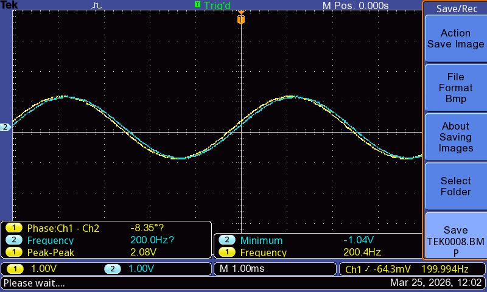
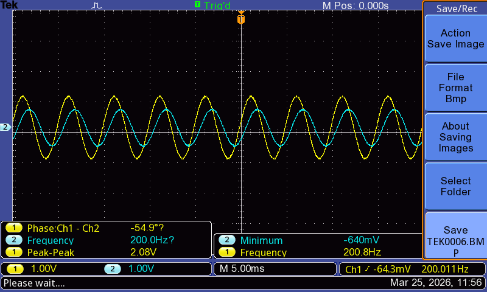
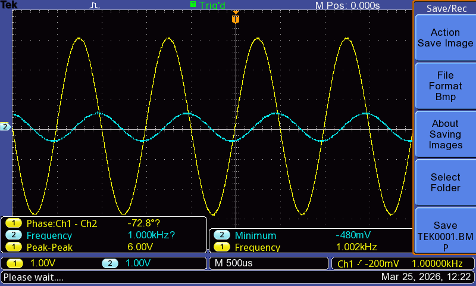

# RC Filter Signal Analysis with Arduino and Oscilloscope

This project studies the behavior of a first-order RC low-pass filter using two complementary approaches:

1. **Arduino-based signal generation and ADC measurement**
2. **Oscilloscope-based validation with sinusoidal inputs from a function generator**

The goal is to understand how an RC filter responds to time-varying signals, and to compare:

- theoretical predictions
- simulated behavior in LTSpice
- measured hardware results

## What This Project Combines

- Analog electronics (RC filter behavior)
- Embedded systems (Arduino PWM and ADC measurement)
- Numerical modeling
- Signal analysis
- Experimental validation with lab instruments

---

## Part I — Arduino-Based RC Filter Experiment

In the first part of the project, the RC filter is driven by an Arduino PWM output that approximates a time-varying analog waveform.

### Circuit Parameters

- **R = 1 kΩ**
- **C = 100 µF**

Time constant:

\[
\tau = RC = 0.1\ \text{s}
\]

### Input Signal

The Arduino-generated waveform is designed to approximate:

\[
V(t) = 2.5\left(1 + 0.5\sin(\omega_1 t) + 0.5\sin(\omega_2 t)\right)
\]

where two potentiometers control the angular frequencies \(\omega_1\) and \(\omega_2\).

Because the Arduino outputs PWM rather than a true analog voltage, the RC filter also acts as a smoothing element.

### Measurements Collected by Arduino

The Arduino measures the capacitor voltage using its ADC and logs:

- input signal estimate
- measured capacitor voltage
- theoretical RC response
- potentiometer values
- time

The data is exported as CSV files for Python-based analysis.

### Theoretical Model

The capacitor voltage is modeled using the first-order RC update equation:

\[
V_c(t+\Delta t) = V_c(t) + (V_{in} - V_c(t))\left(1 - e^{-\Delta t/\tau}\right)
\]

This allows comparison between:

- theoretical response
- measured Arduino data
- LTSpice simulations

---

## Part II — Oscilloscope Validation with Function Generator

To validate the low-pass filter behavior more directly, additional experiments were performed using a **function generator** and **oscilloscope**.

In this setup, sinusoidal signals were applied to the RC filter, and the output voltage across the capacitor was measured on the oscilloscope.

### Important Note

This oscilloscope validation used **different RC values** from the Arduino PWM experiment.

That was intentional:

- the **Arduino experiment** focused on dynamic signal generation, ADC logging, and comparison with a numerical model
- the **oscilloscope experiment** focused on clearly observing attenuation and frequency response under controlled sinusoidal inputs

---

## Selected Oscilloscope Experiments

| Test | R | C | RC | Frequency | \|H(jω)\| | Observation |
|------|---|---|----|-----------|-----------|-------------|
| 1 | 1 kΩ | 100 nF | 0.1 ms | 100 Hz | 0.988 | Output closely matches input amplitude |
| 2 | 4.7 kΩ | 100 nF | 0.47 ms | 100 Hz | 0.959 | Slight attenuation with larger RC |
| 3 | 10 kΩ | 100 nF | 1 ms | 200 Hz | 0.623 | Moderate attenuation |
| 4 | 10 kΩ | 100 nF | 1 ms | 1 kHz | 0.157 | Strong attenuation |

These results show the expected behavior of a first-order low-pass filter:

- at low frequency, the output remains close to the input
- as frequency increases, the output becomes smaller
- larger RC values increase the filtering effect

---

## Oscilloscope Measurements

### 01 — Low frequency, small RC
At 100 Hz with RC = 0.1 ms, the capacitor voltage closely follows the input, showing almost no amplitude reduction.

**Notes:**
- Frequency ≈ 100 Hz
- Output is very close to input amplitude
- This is typical passband behavior for a low-pass filter

---

### 02 — Low frequency, larger RC
At the same frequency (100 Hz) but with a larger time constant, the output still follows the input closely, but a small amplitude reduction is now visible.

**Notes:**
- Frequency ≈ 100 Hz
- Slight attenuation compared with the smaller-RC case
- Shows how increasing RC strengthens the filtering effect

---

### 03 — Mid frequency
At 200 Hz with RC = 1 ms, the output amplitude is clearly reduced, indicating moderate attenuation.

**Notes:**
- Frequency ≈ 200 Hz
- Moderate attenuation is visible
- Output waveform lags behind input
- This is part of the transition region of the low-pass response

---

### 04 — High frequency
At 1 kHz with RC = 1 ms, the output is strongly attenuated, confirming that the RC filter suppresses faster signal variations.

**Notes:**
- Frequency ≈ 1 kHz
- Strong amplitude reduction
- Clear low-pass filtering behavior

---

## Interpretation

The oscilloscope results and Arduino-based measurements both support the same central idea:

> a first-order RC circuit allows slower variations to pass more easily, while reducing faster variations.

In other words:

- **low-frequency signals are preserved more strongly**
- **high-frequency signals are attenuated more strongly**

This is the defining behavior of a low-pass filter.

---

## Files

### Arduino code
- `arduino/rc_filter_final_version.ino`

### Python analysis
- `python_analysis/rc_filter_analysis.py`

### Experimental datasets
- `data/arduino_data_1.csv`
- `data/arduino_data_2.csv`
- `data/arduino_data_3.csv`

### LTSpice simulations
- `LTSpice_schematics/ltspice_rc_filter_single_sine.asc`
- `LTSpice_schematics/ltspice_rc_filter_double_sine.asc`

### Hardware photo
- `hardware_breadboard.jpg`

### Oscilloscope images
- `images/01_low_freq_100Hz_RC_0p1ms.jpg`
- `images/02_low_freq_100Hz_RC_0p47ms.jpg`
- `images/03_mid_freq_200Hz_RC_1ms.jpg`
- `images/04_high_freq_1kHz_RC_1ms.jpg`

---

## Future Work

- Compare theoretical and measured frequency response on the same Python plot
- Add attenuation vs frequency visualization
- Analyze phase shift more systematically
- Extend the project with FFT-based frequency-domain analysis
- Explore additional analog signal-conditioning stages
